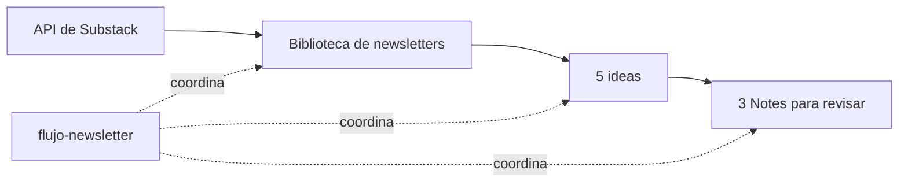

# De newsletters a Notes con ChatGPT Work

Un ejemplo para trabajar conversando con **ChatGPT Work**: le pides que recupere newsletters, proponga ideas y redacte Notes para revisar. Las cuatro skills incluidas guardan el procedimiento para reutilizarlo en las siguientes tandas.

El resultado se revisa antes de publicar. El proyecto no publica en Substack.



La publicación configurada como ejemplo es [Think & Hack, de Aina Lluna](https://ainalluna.substack.com). **Este repositorio contiene el procedimiento, los scripts y ejemplos ficticios; no incluye sus newsletters descargadas ni borradores privados.**

## Qué encontrarás

| Recurso | Para qué sirve |
|---|---|
| [Las cuatro skills](.agents/skills/) | Instrucciones que Work lee cuando ejecuta cada etapa. |
| [Prompts para crearlas](prompts/README.md) | Reproducir el proceso de creación y entender qué pedir. |
| [Prompts para utilizarlas](prompts/05-usar-en-work.md) | Lanzar el flujo, trabajar por etapas y continuar una tanda. |
| [Ejemplo editorial ficticio](ejemplos/README.md) | Ver la relación entre una fuente, una idea y una Note. |
| [Contrato de carpetas](ESTRUCTURA.md) | Entender dónde se guarda todo y qué modifica cada skill. |
| [Configuración](newsletter.config.json) | Publicación, fecha inicial, zona horaria y carpetas compartidas. |
| [Referencia técnica opcional](docs/GUIA-TECNICA.md) | Detalles de los scripts para mantenimiento; no es el recorrido de uso en Work. |

## Usarlo desde ChatGPT Work

Este ejemplo está preparado para **Work en local**, con los archivos en una carpeta del proyecto. En la aplicación de escritorio, selecciona **Work** y **Trabajar en local / Work locally**. [Guía oficial de ChatGPT Work](https://learn.chatgpt.com/docs/get-started-with-work).

### 1. Tener el ejemplo en tu proyecto

Si las skills ya están disponibles en tu proyecto, pasa directamente al paso 2.

Si partes de este repositorio por primera vez, abre un proyecto local en Work y pídele:

> Prepara este proyecto para utilizar el ejemplo de https://github.com/seoutopico/newsletters-a-notes-work. Lee su README, incorpora las skills y sus archivos de apoyo conservando lo que ya exista. Comprueba el entorno disponible y prepara lo que necesiten los scripts. Explícame qué has preparado y avísame si algo impide continuar. Todavía no ejecutes el flujo.

**La preparación también se la encargas a Work.** Puede haber requisitos técnicos para los scripts, pero no tienes que empezar copiando comandos de instalación en una terminal. Work debe comprobar qué tiene disponible y resolver la preparación con las herramientas y permisos de su sesión.

El proyecto debe tener acceso a la carpeta donde se guarden las skills y el trabajo. [Documentación de proyectos locales](https://learn.chatgpt.com/docs/projects).

### 2. Seleccionar el flujo y pedir el trabajo

Abre una conversación de Work dentro de ese proyecto. Escribe **`@`**, busca **`flujo-newsletter`**, selecciónala y envía:

> Ejecuta el flujo completo en una tanda nueva: actualiza la biblioteca, prepara cinco ideas y redacta tres Notes. Abre las Notes para revisarlas. No publiques nada.

Elegir la skill en el menú la incorpora al mensaje; el trabajo empieza al pulsar **Enviar**. Para el flujo completo solo necesitas seleccionar `flujo-newsletter`. Tienes el [paso a paso de selección con @ y los nombres de las cuatro skills](prompts/05-usar-en-work.md#seleccionar-una-skill).

Work leerá las skills, utilizará sus scripts y realizará la parte editorial. Tú puedes seguir el progreso, corregir el rumbo y revisar los resultados.

La selección de skills mediante `@` está descrita en la [documentación oficial](https://learn.chatgpt.com/docs/build-skills). Si no aparece tras preparar el proyecto, abre una conversación nueva dentro de él o pide a Work que lea `.agents/skills/flujo-newsletter/SKILL.md` explícitamente.

**Los prompts de creación son material para aprender cómo se diseñaron las skills. Para utilizarlas no tienes que volver a crearlas.**

### 3. Revisar y continuar en la conversación

Cuando Work abra las Notes, puedes pedir cambios en la misma conversación:

> Haz más concreta la apertura de la segunda Note. Mantén su idea central y conserva las otras dos.

Los cambios se guardan en la misma tanda. Para otra tanda, pide una nueva ejecución del flujo.

### Adaptar la publicación o el periodo

El ejemplo utiliza Think & Hack, de Aina Lluna, y una fecha inicial fija: 12 de septiembre de 2025. Si quieres otro periodo, puedes decirle a Work antes de empezar:

> Configura la primera descarga para cubrir los últimos doce meses. Si ya existe una biblioteca, conserva su fecha inicial y sus archivos.

Para otra publicación, pídele que adapte tanto la configuración como las referencias de autor, audiencia y tono de las skills editoriales. Work mantiene estos ajustes en los archivos del proyecto para las siguientes ejecuciones.

## Cuatro formas de trabajar

| Forma | Qué pedir |
|---|---|
| Todo seguido | Seleccionar `flujo-newsletter` y pedir las tres etapas completas. |
| Revisar antes de redactar | Seleccionar `flujo-newsletter` y añadir: «Detente después de las ideas y espera mis correcciones». |
| Solo una etapa | Seleccionar `recuperar-newsletters`, `ideas-para-notes` o `redactar-notes`, según lo que falte. |
| Continuar otro día | Volver a la conversación y pedir que continúe la misma tanda desde la etapa pendiente. |

Una conversación por tanda suele facilitar la revisión. Si continúas en otra conversación del mismo proyecto, indica la carpeta concreta de la tanda: las referencias persistentes viven en los archivos, no dependen de recordar todo el chat anterior.

Ejemplos completos para copiar: [usar el flujo en Work](prompts/05-usar-en-work.md).

## Qué hace cada skill

| Skill | Responsabilidad |
|---|---|
| [recuperar-newsletters](.agents/skills/recuperar-newsletters/SKILL.md) | Consultar la API, paginar, incorporar novedades, actualizar versiones y señalar extractos o fallos. |
| [ideas-para-notes](.agents/skills/ideas-para-notes/SKILL.md) | Leer fuentes completas y proponer cinco enfoques con utilidad propia y una conexión al original. |
| [redactar-notes](.agents/skills/redactar-notes/SKILL.md) | Elegir tres ideas y escribir Notes respaldadas por las fuentes, separando texto y comentario editorial. |
| [flujo-newsletter](.agents/skills/flujo-newsletter/SKILL.md) | Coordinar las tres anteriores y pasar la salida de cada una a la siguiente. |

La coordinadora reutiliza las otras skills. Work realiza la lectura y redacción editorial, mientras los scripts le ayudan a descargar, organizar los archivos y conservar el estado de cada tanda.

## Dónde queda el trabajo

Las carpetas de datos se generan al utilizar el flujo; no vienen con contenido real en el repositorio.

```text
biblioteca/
  articulos/                 Una copia actual por newsletter
  INDICE.md
  control/                   Inventario, respuestas actuales e informes
    historial/               Versiones anteriores cuando cambia una fuente

tandas/
  AAAA-MM-DD_HH-mm-ss/
    ideas-para-notes.md
    notes-para-revisar.md
    RESUMEN.md
    estado.json
```

Una tanda contiene sus ideas y sus Notes juntas. Las fuentes se referencian por ID y versión; no se copian en cada tanda. Las tres skills utilizan la misma estructura, también al ejecutarse por separado.

**«Sin novedades en la descarga» no significa «sin trabajo editorial».** Si hay newsletters guardadas y pendientes de aprovechar, el flujo continúa con ellas. Si ya hay propuestas, busca enfoques distintos y mantiene el historial para evitar repeticiones.

## Programarlo después de probarlo

Cuando hayas revisado una ejecución manual, puedes pedir a Work una tarea local que invoque `flujo-newsletter` con la frecuencia que quieras. El prompt de ejemplo está en [usar el flujo](prompts/05-usar-en-work.md#programación-opcional).

Las tareas con archivos locales necesitan que el ordenador esté encendido y que la aplicación esté abierta. Revisa estado e historial en **Tareas programadas / Scheduled**. Consulta la [documentación de tareas programadas](https://learn.chatgpt.com/docs/automations).

Preparar este ejemplo en tu proyecto no crea ni activa ninguna programación.

## Alcance y comprobaciones

- La API de lectura de Substack puede cambiar. Los errores se registran y las copias completas anteriores se conservan.
- «Completo» describe el cuerpo público devuelto por la API, sin bloqueo explícito detectado; no acredita acceso a una edición privada.
- No se eluden suscripciones. Las imágenes y recursos multimedia quedan enlazados.
- La prueba automatizada del paquete cubre 18 casos de descarga, conservación y continuidad. No mide calidad editorial ni garantiza que la API siga disponible.
- El material de `ejemplos/` es ficticio y no se presenta como una ejecución real.
- `.gitignore` excluye la biblioteca y las tandas locales. Si cambias sus nombres, adapta también esas exclusiones antes de subir tus resultados a GitHub.

Las indicaciones de interfaz se contrastaron con documentación oficial el 13 de septiembre de 2026; la interfaz y la disponibilidad pueden variar por versión o cuenta.
