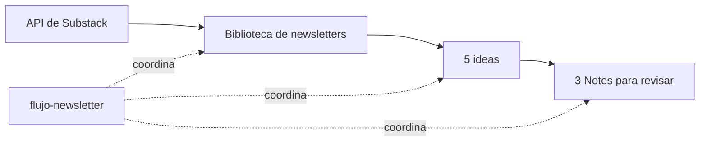

# De newsletters a Notes con ChatGPT Work

Un ejemplo práctico para convertir un archivo de newsletters en ideas y borradores de Notes de Substack, usando cuatro skills locales y una estructura de carpetas compartida.

El resultado se revisa antes de publicar. El proyecto no publica en Substack.



La publicación configurada como ejemplo es [Think & Hack, de Aina Lluna](https://ainalluna.substack.com). **Este repositorio contiene el procedimiento, los scripts y ejemplos ficticios; no incluye sus newsletters descargadas ni borradores privados.**

## Qué encontrarás

| Recurso | Para qué sirve |
|---|---|
| [Las cuatro skills](.agents/skills/) | Instrucciones que Work lee cuando ejecuta cada etapa. |
| [Prompts para crearlas](prompts/README.md) | Reproducir el proceso de creación y entender qué pedir. |
| [Prompts para utilizarlas](prompts/05-usar-en-work.md) | Lanzar el flujo, trabajar por etapas y continuar una tanda. |
| [Ejemplo editorial ficticio](ejemplos/README.md) | Ver la relación entre una fuente, una idea y una Note. |
| [Contrato de carpetas](ESTRUCTURA.md) | Entender dónde se guarda todo y qué modifica cada skill. |
| [Configuración](newsletter.config.json) | Publicación, fecha inicial, zona horaria y carpetas compartidas. |
| [Guía técnica](docs/GUIA-TECNICA.md) | Dependencias, comandos, pruebas y límites del ejemplo. |

## Probarlo en Work

### 1. Preparar el proyecto local

Descarga este repositorio desde **Code → Download ZIP** y descomprímelo, o clónalo:

```sh
git clone https://github.com/seoutopico/newsletters-a-notes-work.git
```

En la aplicación de escritorio, crea o selecciona un **proyecto local** y vincula la carpeta descargada. Usa como carpeta principal aquella que contiene `README.md`, `newsletter.config.json` y `.agents/`.

Este ejemplo necesita acceso a una carpeta del ordenador. Un proyecto de ChatGPT con archivos subidos y un proyecto local tienen formas distintas de acceder a las fuentes. Consulta la [documentación de proyectos](https://learn.chatgpt.com/docs/projects).

### 2. Instalar las dependencias

Necesitas Python 3.11 o posterior, `requests` y `tzdata`. Puedes pedirle a Work que compruebe el entorno e instale las dependencias del repositorio, o ejecutar desde su carpeta:

```sh
python -m pip install -r requirements.txt
```

La lectura y redacción editorial las realiza Work. Estos scripts no necesitan una clave de la API de OpenAI.

### 3. Revisar la configuración

Abre `newsletter.config.json`. La configuración incluida usa Aina Lluna, la zona `Europe/Madrid` y una fecha inicial fija de ejemplo: **12 de septiembre de 2025**.

Si quieres comenzar con los últimos doce meses, ajusta `desde` antes de la primera descarga. Después, mantenla: la biblioteca es acumulativa. El código no calcula una ventana móvil de doce meses en cada ejecución.

Para otra publicación, cambia también las referencias de audiencia y voz en las skills editoriales. Cambiar solo la URL no convierte el estilo de Aina en el de otra persona.

### 4. Lanzar el flujo completo

Abre una nueva conversación en **Work**, dentro del proyecto local. Escribe **`@`**, busca **`flujo-newsletter`**, selecciónala y envía:

> Ejecuta el flujo completo en una tanda nueva: actualiza la biblioteca, prepara cinco ideas y redacta tres Notes. Abre las Notes para revisarlas. No publiques nada.

La selección explícita de skills mediante `@` y su elección automática por descripción están descritas en la [documentación oficial de skills](https://learn.chatgpt.com/docs/build-skills). Si no aparece, comprueba la carpeta principal del proyecto y que existe `.agents/skills/flujo-newsletter/SKILL.md`; puedes pedir a Work que lea ese archivo de forma explícita.

**No necesitas usar los prompts de creación para ejecutar estas skills: ya vienen incluidas.**

## Cuatro formas de trabajar

| Forma | Qué pedir |
|---|---|
| Todo seguido | Seleccionar `flujo-newsletter` y pedir las tres etapas completas. |
| Revisar antes de redactar | Seleccionar `flujo-newsletter` y añadir: «Detente después de las ideas y espera mis correcciones». |
| Solo una etapa | Seleccionar `recuperar-newsletters`, `ideas-para-notes` o `redactar-notes`, según lo que falte. |
| Continuar otro día | Volver a la conversación y pedir que continúe la misma tanda desde la etapa pendiente. |

Una conversación por tanda suele facilitar la revisión. Si continúas en otra conversación del mismo proyecto, indica la carpeta concreta de la tanda: las referencias persistentes viven en los archivos, no dependen de recordar todo el chat anterior.

Ejemplos completos para copiar: [usar el flujo en Work](prompts/05-usar-en-work.md).

## Qué hace cada skill

| Skill | Responsabilidad |
|---|---|
| [recuperar-newsletters](.agents/skills/recuperar-newsletters/SKILL.md) | Consultar la API, paginar, incorporar novedades, actualizar versiones y señalar extractos o fallos. |
| [ideas-para-notes](.agents/skills/ideas-para-notes/SKILL.md) | Leer fuentes completas y proponer cinco enfoques con utilidad propia y una conexión al original. |
| [redactar-notes](.agents/skills/redactar-notes/SKILL.md) | Elegir tres ideas y escribir Notes respaldadas por las fuentes, separando texto y comentario editorial. |
| [flujo-newsletter](.agents/skills/flujo-newsletter/SKILL.md) | Coordinar las tres anteriores y pasar la salida de cada una a la siguiente. |

La coordinadora no repite los criterios editoriales de las otras skills. Los scripts gestionan descarga, archivos, versiones y estado; **no escriben las ideas y las Notes por sí solos**. Ejecutar únicamente `preparar` en una terminal deja una tanda pendiente de trabajo editorial.

## Dónde queda el trabajo

Las carpetas de datos se generan al utilizar el flujo; no vienen con contenido real en el repositorio.

```text
biblioteca/
  articulos/                 Una copia actual por newsletter
  INDICE.md
  control/                   Inventario, respuestas actuales e informes
    historial/               Versiones anteriores cuando cambia una fuente

tandas/
  AAAA-MM-DD_HH-mm-ss/
    ideas-para-notes.md
    notes-para-revisar.md
    RESUMEN.md
    estado.json
```

Una tanda contiene sus ideas y sus Notes juntas. Las fuentes se referencian por ID y versión; no se copian en cada tanda. Las tres skills utilizan la misma estructura, también al ejecutarse por separado.

**«Sin novedades en la descarga» no significa «sin trabajo editorial».** Si hay newsletters guardadas y pendientes de aprovechar, el flujo continúa con ellas. Si ya hay propuestas, busca enfoques distintos y mantiene el historial para evitar repeticiones.

## Programarlo después de probarlo

Cuando hayas revisado una ejecución manual, puedes pedir a Work una tarea local que invoque `flujo-newsletter` con la frecuencia que quieras. El prompt de ejemplo está en [usar el flujo](prompts/05-usar-en-work.md#programación-opcional).

Las tareas con archivos locales necesitan que el ordenador esté encendido y que la aplicación esté abierta. Revisa estado e historial en **Tareas programadas / Scheduled**. Consulta la [documentación de tareas programadas](https://learn.chatgpt.com/docs/automations).

Clonar este repositorio no crea ni activa ninguna programación.

## Alcance y comprobaciones

- La API de lectura de Substack puede cambiar. Los errores se registran y las copias completas anteriores se conservan.
- «Completo» describe el cuerpo público devuelto por la API, sin bloqueo explícito detectado; no acredita acceso a una edición privada.
- No se eluden suscripciones. Las imágenes y recursos multimedia quedan enlazados.
- La prueba automatizada del paquete cubre 18 casos de descarga, conservación y continuidad. No mide calidad editorial ni garantiza que la API siga disponible.
- El material de `ejemplos/` es ficticio y no se presenta como una ejecución real.
- `.gitignore` excluye la biblioteca y las tandas locales. Si cambias sus nombres, adapta también esas exclusiones antes de subir tus resultados a GitHub.

Las indicaciones de interfaz se contrastaron con documentación oficial el 13 de septiembre de 2026; la interfaz y la disponibilidad pueden variar por versión o cuenta.
